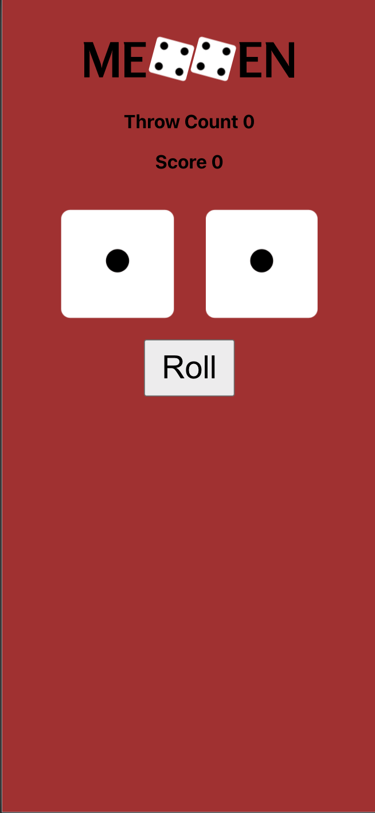

# Mexxen

Make an old school drinking game for your mobile phone browser. If you roll the dice, mex can be thrown. This means that the number of sips is doubled. Below is a nice screenshot of the app.



### What you need to do

If you want to play the game you can clone the project to your own computer and start the server with the following scripts.

```git clone```
```cd dice_games```
```npm install```
```npm start```

### Progress
- [x] Dice Component
- [x] Dices Component
- [x] Game Component
- [x] Score Check
- [x] Pop up when you score is 31 or 21
- [x] Statistics
- [ ] Hold a dice for one turn 
- [ ] Add Players
- [ ] Socket.io?


